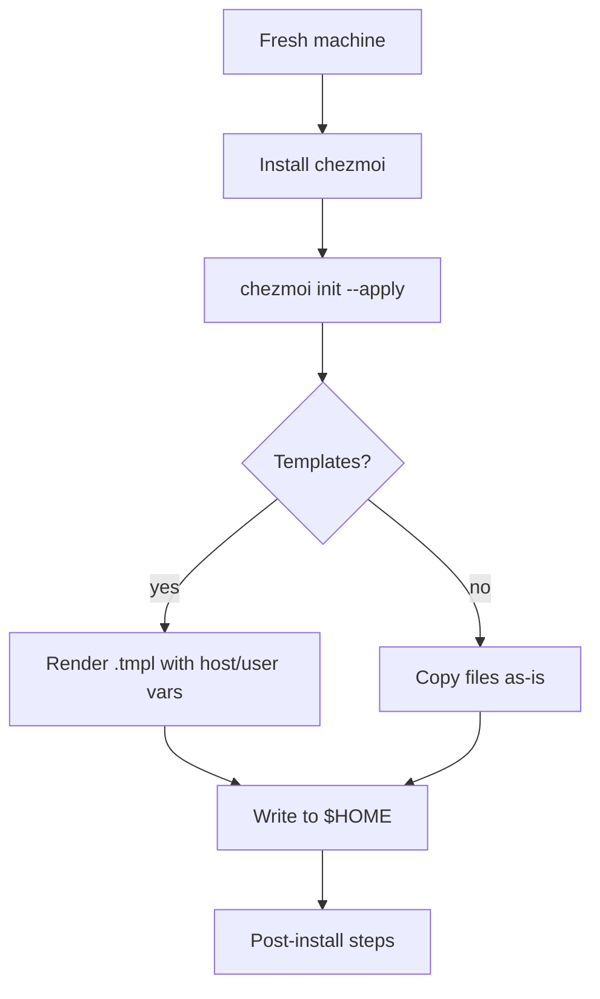
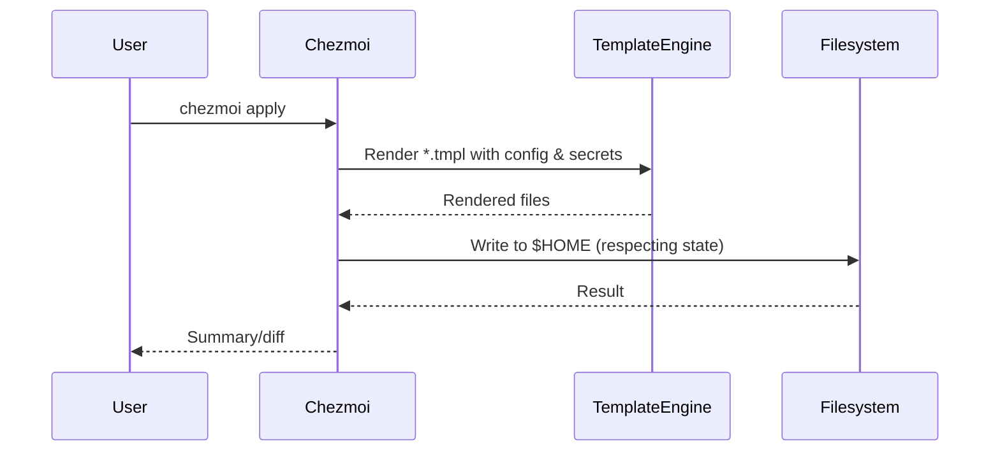

# dotfiles

My personal configuration files for development environments on macOS and Linux systems. Many configurations are templated to work across different systems.

> **Note:** Many keybindings in these configurations are designed for a Colemak Mod-DH keyboard layout. You may need to adjust them for your own keyboard layout.

## Prerequisites

* [Git](https://git-scm.com/) - Required for cloning the repository
* [Chezmoi](https://www.chezmoi.io/) - Required for dotfile management
* [Zsh](https://www.zsh.org/) - Required for shell configuration
* For Linux configurations:
  * [Hyprland](https://hyprland.org/) - Wayland compositor
  * [Niri](https://github.com/YaLTeR/niri) - Dynamic Wayland tiling window manager (optional)
  * [Waybar](https://github.com/Alexays/Waybar) - Status bar
  * [Mako](https://github.com/emersion/mako) - Notification daemon
  * [Wofi](https://hg.sr.ht/~scoopta/wofi) - Application launcher
  * [Fuzzel](https://codeberg.org/dnkl/fuzzel) - Wayland application launcher (optional)

## Chezmoi

This repo uses [chezmoi](https://www.chezmoi.io/) for most dotfile management

### Deployment

1. Install chezmoi
2. Run `chezmoi init git@github.com:jeffnm/dotfiles.git`
3. Answer any prompts (wallpaper paths for example)
4. Run `chezmoi status` to see which files will be affected.
5. Use `chezmoi diff <filename>` when needing to see what the difference between the source and target are.
6. If there were issues, then use `chezmoi apply <filename>` or `chezmoi re-add <filename>` or otherwise resolve the conflict.
7. If everything is good, run `chezmoi apply` to add all managed files from source.

### Diagrams

Below are draft Mermaid diagrams that explain setup and apply flows. GitHub renders these automatically.

## Managed files

- [dotfiles](#dotfiles)
  - [Prerequisites](#prerequisites)
  - [Chezmoi](#chezmoi)
    - [Deployment](#deployment)
    - [Diagrams](#diagrams)
  - [Managed files](#managed-files)
    - [Alacritty](#alacritty)
    - [Atuin](#atuin)
    - [Gitconfig](#gitconfig)
    - [Gitconfig-work](#gitconfig-work)
    - [Helix](#helix)
    - [hyprland dots](#hyprland-dots)
    - [Niri](#niri)
    - [mako](#mako)
    - [vimrc](#vimrc)
    - [waybar](#waybar)
    - [wofi](#wofi)
    - [Fuzzel](#fuzzel)
    - [Yazi](#yazi)
    - [Zellij](#zellij)
    - [zimrc](#zimrc)
    - [Zshenv](#zshenv)
    - [Zshrc](#zshrc)
      - [Unmaintained](#unmaintained)

### Alacritty

Some basic Alacritty configs, with a template to handle MacOS vs. Linux differences.

**Path:** `~/.config/alacritty/` from `dot_config/alacritty/`

### Atuin

Shell history management tool. Configuration for synchronization and keybindings.

**Path:** `~/.config/atuin/` from `dot_config/private_atuin/`

### Gitconfig

Git configuration with user information and aliases. Templated for different environments.

**Path:** `~/.gitconfig` from `dot_gitconfig.tmpl`

### Gitconfig-work

Private Git configuration for work-specific settings.

**Path:** `~/.gitconfig-work` from `private_dot_gitconfig-work.tmpl`

### Helix

My very personalized Helix config with keymaps for my custom keyboard layout. No language config is being managed because the details of what should be in that are so system dependent. The keybindings are specifically designed for Colemak Mod-DH keyboard layout.

**Path:** `~/.config/helix/config.toml` from `dot_config/helix/config.toml`

### hyprland dots

Configs for hyprland live in hypr. This is my preferred Linux Wayland environment and has family of associated applications that also have configs.

**Path:** `~/.config/hypr/` from `dot_config/hypr/`

### Niri

Dynamic tiling Wayland window manager configuration. Enabled on Linux by default via `enableNiri` in `.chezmoi.toml.tmpl` and conditionally ignored via `.chezmoiignore` when disabled.

Toggle with `enableNiri` in `.chezmoi.toml.tmpl` or set at init time. When enabled, files are applied to `$HOME`.

**Path:** `~/.config/niri/` from `dot_config/niri/`

### mako

Linux notification system. Simple styling config.

**Path:** `~/.config/mako/` from `dot_config/mako/`

### vimrc

My .vimrc config. Not my default editor any longer, but worth holding onto configs for as a backup.

**Path:** `~/.vimrc` from `dot_vimrc`

### waybar

System bar for Linux. Elements and styling for use with Hyprland.

**Path:** `~/.config/waybar/` from `dot_config/waybar/`

### wofi

Wayland variant on the rofi launcher. Config and styling for my Hyprland.

**Path:** `~/.config/wofi/` from `dot_config/wofi/`

### Fuzzel

Wayland application launcher used with Niri/Hyprland. Enabled on Linux by default via `enableFuzzel` in `.chezmoi.toml.tmpl` and conditionally ignored via `.chezmoiignore` when disabled.

Toggle with `enableFuzzel` in `.chezmoi.toml.tmpl`. When enabled, files are applied to `$HOME`.

**Path:** `~/.config/fuzzel/` from `dot_config/fuzzel/`

### Yazi

Terminal file manager with image preview support. Configuration for keybindings and appearance.

**Path:** `~/.config/yazi/` from `dot_config/yazi/`

### Zellij

Terminal multiplexer with a focus on user experience. Configuration for layouts, keybindings, and themes.

**Path:** `~/.config/zellij/` from `dot_config/zellij/`

### zimrc

My .zimrc config which is used for the zim plugin manager for zsh. Templated for MacOS and Linux.

**Path:** `~/.zimrc` from `private_dot_zimrc.tmpl`

### Zshenv

Environment variables for Zsh. Templated for different systems.

**Path:** `~/.zshenv` from `dot_zshenv.tmpl`

### Zshrc

My .zshrc file. Templated for MacOS and Linux.

**Path:** `~/.zshrc` from `private_dot_zshrc.tmpl`

#### Unmaintained

I kept a copy of my xmonad config in `xmonad/` since it was the config that hooked me on tiling window managers. Eventually I'll delete it since I'm not going back to x11 again if I can help it.
